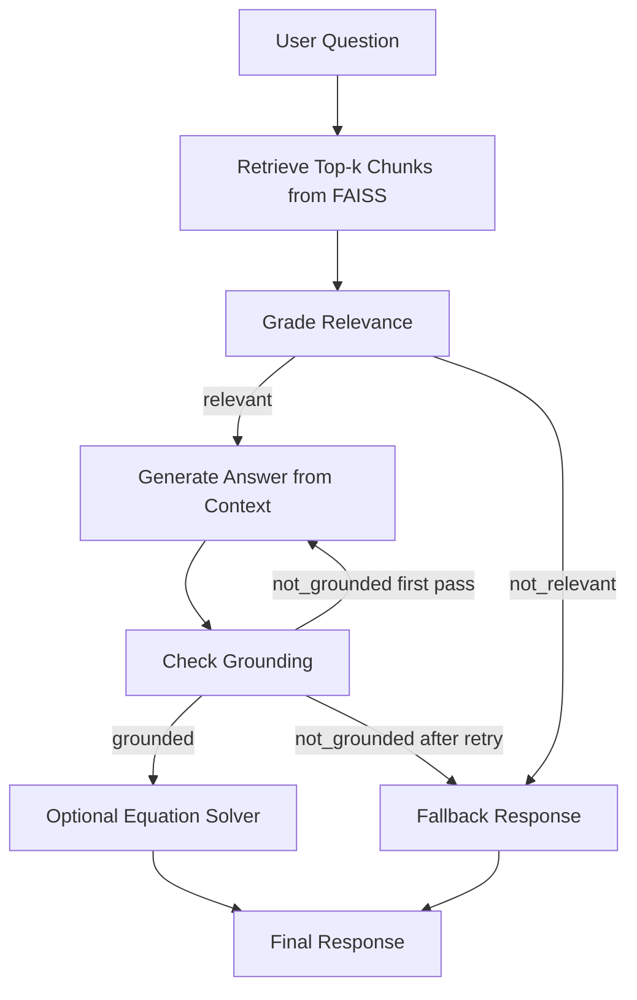

<div align="center">

# 🤖 Agentic-RAG

### A LangGraph-based Retrieval-Augmented Generation system with relevance gating, grounding checks, and equation-solving support.

<p>
  
  
  
  
  
</p>

</div>

---

## 📌 Table of Contents

- [1) What is this project?](#1-what-is-this-project)
- [2) Why Agentic RAG?](#2-why-agentic-rag)
- [3) End-to-End Process](#3-end-to-end-process)
- [4) System Architecture](#4-system-architecture)
- [5) Detailed Workflow](#5-detailed-workflow)
- [6) How this differs from common market RAG implementations](#6-how-this-differs-from-common-market-rag-implementations)
- [7) Detailed Analogy (How it works in simple terms)](#7-detailed-analogy-how-it-works-in-simple-terms)
- [8) Setup and Run](#8-setup-and-run)
- [9) Repository Structure](#9-repository-structure)
- [10) Testing](#10-testing)
- [11) Current Limitations and Practical Improvements](#11-current-limitations-and-practical-improvements)

---

## 1) What is this project?

**Agentic-RAG** is a retrieval-augmented generation system that uses a **stateful graph workflow** instead of a single straight prompt chain.

It combines:

- Document ingestion (`PDF`, `TXT`, `MD`) into a `FAISS` vector database
- Context retrieval using embeddings
- LLM-based relevance grading
- LLM-based grounding checks
- Conditional routing to fallback or answer regeneration
- Optional equation extraction/solving via SymPy
- Streamlit chat interface for user interaction

In short: this is a **decision-driven RAG pipeline**, not just “retrieve once and answer once.”

---

## 2) Why Agentic RAG?

Traditional RAG often performs:

1. Retrieve chunks
2. Send chunks to model
3. Return answer

That works for many cases, but it can fail silently when context is irrelevant or weakly grounded.

This project adds **agentic control points**:

- Is the retrieved context relevant?
- Is the generated answer grounded in context?
- If not, should we retry generation or safely fallback?
- If user intent is equation-driven, can we also run symbolic solving?

These checks improve reliability and interpretability for technical/scientific Q&A.

---

## 3) End-to-End Process



---

## 4) System Architecture

| Layer | Component | File | Responsibility |
|---|---|---|---|
| UI | Streamlit chat app | `src/app.py` | Handles user chat input/output |
| Orchestration | LangGraph state machine | `src/graph.py` | Controls branching logic and retries |
| Retrieval | FAISS retriever | `src/graph.py` + `vector_db/` | Fetches top relevant chunks |
| Ingestion | Loader + splitter + embedding index build | `src/ingest.py` | Reads docs and builds vector store |
| Tooling | Equation extraction and symbolic solving | `src/tools.py` | Solves equations from retrieved context |
| Testing | Unit/integration-style tests | `test/test_rag.py` | Verifies routing, tool behavior, and pipeline logic |

---

## 5) Detailed Workflow

### A) Ingestion pipeline

| Step | What happens |
|---|---|
| 1 | Load files from `data/` (`.pdf`, `.txt`, `.md`) |
| 2 | Normalize source metadata (filename attached per doc) |
| 3 | Split content into chunks (`chunk_size=1000`, `chunk_overlap=200`) |
| 4 | Embed chunks with `text-embedding-3-small` |
| 5 | Store index in `vector_db/faiss_index` |

### B) Query-time pipeline

| Stage | Decision / Action | Output |
|---|---|---|
| Retrieve | Search top 5 chunks from FAISS | `documents`, assembled `context` |
| Relevance grader | LLM classifies context as `relevant` or `not_relevant` | `relevance_score` |
| Answer generation | LLM generates answer using retrieved context only | `answer` |
| Grounding checker | LLM classifies answer as `grounded` or `not_grounded` | `grounded_score` |
| Retry logic | If not grounded and retries left, regenerate answer | Updated `answer` |
| Fallback | If irrelevant or still ungrounded, return safe fallback | Reliability-preserving final response |
| Equation tool | If question suggests equation intent, run SymPy solver | `equation_result` appended |

### C) State carried in graph

| State Key | Meaning |
|---|---|
| `question` | User query |
| `documents` | Retrieved document objects |
| `context` | Combined retrieved text with source metadata |
| `relevance_score` | Relevance decision |
| `answer` | Current generated answer |
| `grounded_score` | Grounding decision |
| `equation_result` | Tool output for equations |
| `retries` | Regeneration counter |

---

## 6) How this differs from common market RAG implementations

> Reference point: many publicly available RAG demos in the market are single-pass retrieval+generation pipelines.

| Capability | Typical single-pass RAG | This Agentic-RAG |
|---|---|---|
| Orchestration model | Linear chain | Conditional state graph (LangGraph) |
| Relevance guardrail | Often missing | Explicit relevance grading node |
| Grounding verification | Rare / implicit | Explicit grounding check node |
| Recovery behavior | Usually returns first answer | Retry + safe fallback path |
| Tool augmentation | Limited | Equation extraction + SymPy solving |
| Explainable flow | Harder to trace | Node-by-node deterministic routing |
| Scientific use-cases | Basic QA support | Better suited for formula/equation-aware queries |

### Practical differentiation

- This project is not just “RAG + UI”; it is **RAG + decision policy**.
- It encodes **quality gates** before trusting final output.
- It supports **tool-augmented post-processing** for equation-heavy contexts.

---

## 7) Detailed Analogy (How it works in simple terms)

Imagine a **research assistant in a technical library**:

1. **Retriever = Librarian**
   - Finds the top relevant books/pages for your question.

2. **Relevance grader = Senior editor (Checkpoint 1)**
   - Verifies whether the retrieved pages are actually related to your question.
   - If not related, the assistant avoids bluffing and gives a safe response.

3. **Answer generator = Research writer**
   - Drafts an answer using only the approved pages.

4. **Grounding checker = Fact-checker (Checkpoint 2)**
   - Checks if the draft is truly supported by the provided sources.
   - If weakly supported, sends it back once for rewrite.

5. **Equation tool = Math specialist**
   - If your question asks to solve/derive/calculate, a math specialist reviews equations in the source and provides symbolic results.

6. **Fallback response = Integrity policy**
   - If evidence is weak, the system says “not enough grounded information” instead of hallucinating.

So this agent behaves like a **small technical team** with reviewers and specialists, not a single person answering immediately.

---

## 8) Setup and Run

### Prerequisites

- Python **3.10**
- OpenAI API key

### Installation

```bash
pip install -r requirements.txt
```

### Set environment variable

```bash
export OPENAI_API_KEY=your_key_here
```

### Add source documents

Place your `.pdf`, `.txt`, `.md` files in:

```text
data/
```

### Build vector database

```bash
python src/ingest.py
```

### Launch app

```bash
streamlit run src/app.py
```

---

## 9) Repository Structure

```text
Agentic-RAG/
├── data/                  # Input documents for ingestion
├── src/
│   ├── app.py             # Streamlit UI
│   ├── graph.py           # LangGraph workflow and routing logic
│   ├── ingest.py          # Document loading, chunking, FAISS build
│   └── tools.py           # Equation extraction and SymPy solver
├── test/
│   └── test_rag.py        # Comprehensive test suite
├── requirements.txt
└── README.md
```

---

## 10) Testing

Run tests from repository root:

```bash
python -m pytest -q
```

The tests cover:

- Graph routing behavior
- Relevance and grounding decision flow
- Equation tool behavior
- Ingestion and vector DB creation functions

---

## 11) Current Limitations and Practical Improvements

| Area | Current behavior | Improvement direction |
|---|---|---|
| Retry policy | Single retry path | Multi-strategy retry (query reformulation / re-retrieval) |
| Retrieval strategy | Fixed top-k | Hybrid retrieval + reranking |
| Grounding check | LLM classifier text output | Structured scoring + calibration |
| Equation extraction | Regex heuristics | Better parser for scientific notation and LaTeX blocks |
| Production readiness | Local FAISS + Streamlit demo style | Add observability, auth, and deployment hardening |


